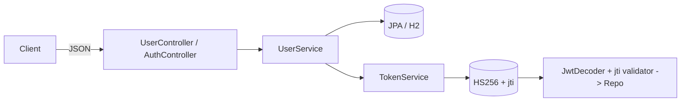

# Users API — Spring Boot + H2 + JWT (con rotación por jti)

API RESTful para registro de usuarios.
Todos los endpoints aceptan y retornan JSON (incluye errores con el formato {"mensaje":"..."}).

## Índice
- [Características](#Características)
- [Requisitos](#Requisitos)
- [Arranque rápido](#Arranque-rápido)
- [Perfiles y datos semilla](#Perfiles-y-datos-semilla)
- [Configuración](#Configuración)
- [Autenticación](#Autenticación)
- [Endpoints](#Endpoints)
- [Modelo de errores](#Modelo-de-errores)
- [Swagger / OpenAPI](#Swagger-OpenAPI)
- [Diseño y arquitectura](#Diseño-y-arquitectura)
- [Tests](#Tests)
- [Build_/_CI](#Build-CI)
- [Roadmap](#Roadmap)

## Características

1. Registro de usuario con validaciones configurables (regex de email y password).
2. Persistencia en H2 (en memoria por defecto).
3. JWT firmado HS256, con roles y revocación por jti: solo el último login es válido.
4. Errores JSON consistentes: {"mensaje":"..."}. 
5. Swagger UI para explorar la API. 
6. Tests (service, controller, security).

## Requisitos
Java 17+
Gradle (se incluye wrapper)

## Arranque rápido
```bash
# 1) Ejecutar la app (perfil por defecto)
./gradlew bootRun

# App
# http://localhost:8080

# H2 Console
# http://localhost:8080/h2-console
# JDBC URL: jdbc:h2:mem:usersdb   | User: sa | Password: (vacío)

## Cómo configurar el proyecto
```
La base es en memoria y se recrea en cada arranque (usando schema.sql).

## Perfiles y datos semilla
Para probar login rápidamente
```bash
./gradlew bootRun
```
Usuario semilla:
email: juan@rodriguez.org
password: Abcdef12
El seeder guarda en users.token un jti y solo el último login emitirá un JWT válido (los anteriores quedan revocados).

## Configuración
Archivo: src/main/resources/application.yml (extracto relevante)
```yaml
server:
  port: 8080

spring:
  datasource:
    url: jdbc:h2:mem:usersdb;DB_CLOSE_DELAY=-1;DB_CLOSE_ON_EXIT=FALSE
    driverClassName: org.h2.Driver
    username: sa
    password:
  jpa:
    hibernate:
      ddl-auto: none
    properties:
      hibernate:
        format_sql: true
  h2:
    console:
      enabled: true
      path: /h2-console
  sql:
    init:
      mode: always

app:
  regex:
    email: "^[A-Za-z0-9._%+-]+@[A-Za-z0-9.-]+\\.[A-Za-z]{2,}$"
    password: "^(?=.*[A-Z])(?=.*\\d).{8,}$"

springdoc:
  api-docs.path: /v3/api-docs
  swagger-ui.path: /swagger-ui

security:
  jwt:
    secret: ${JWT_SECRET:test-secret-32-chars-min-1234567890}
    expiration-minutes: 120

```

## Autenticación

1) Login → obtener JWT

```bash
curl -s -X POST http://localhost:8080/api/auth/login \
  -H "Content-Type: application/json" \
  -d '{"email":"juan@rodriguez.org","password":"Abcdef12"}'
# -> {"token":"<JWT>"}
```
2) Usar el JWT
Incluye el token en el header:
```bash
Authorization: Bearer <JWT>
```
Rotación por jti: cada login genera un nuevo jti que se persiste en BD.
Solo el JWT cuyo jti coincide con users.token es válido; tokens anteriores quedan revocados aunque no hayan expirado.

## Endpoints

Registrar usuario (protegido: ROLE_USER)

POST /api/users
Content-Type: application/json
Authorization: Bearer <JWT>

### Request
```json
{
  "name": "Juan Rodriguez",
  "email": "juan@rodriguez.org",
  "password": "Abcdef12",
  "phones": [
    { "number": "1234567", "citycode": "1", "contrycode": "57" }
  ]
}

```
### Response 201
```json
{
  "id": "72d3ca81-b688-469f-a27b-7060953508a1",
  "name": "Juan Rodriguez",
  "email": "juan@rodriguez.org",
  "created": "2025-08-20T12:23:35.244885",
  "modified": "2025-08-20T12:23:35.244885",
  "last_login": "2025-08-20T12:23:35.244885",
  "token": "ed9e8be6-eefb-4fbf-a1d6-3ee0a9f4dcee",
  "isactive": true,
  "phones": [
    { "number": "1234567", "citycode": "1", "contrycode": "57" }
  ]
}

```

cURL ejemplo

```bash
TOKEN=$(curl -s -X POST http://localhost:8080/api/auth/login \
  -H 'Content-Type: application/json' \
  -d '{"email":"juan@rodriguez.org","password":"Abcdef12"}' | jq -r .token)

curl -i -X POST http://localhost:8080/api/users \
  -H "Authorization: Bearer $TOKEN" \
  -H "Content-Type: application/json" \
  -d '{"name":"Jane","email":"jane@mail.com","password":"Abcd1234",
       "phones":[{"number":"1234567","citycode":"1","contrycode":"57"}]}'
```

## Modelo de errores

Siempre JSON:
*    Email duplicado → 409 Conflict
```json
{ "mensaje": "El correo ya registrado" }

```
* Validaciones (email/password) → 400 Bad Request

```json
{ "mensaje": "El correo no cumple el formato" }

```
```json
{ "mensaje": "La clave no cumple el formato" }

```

* Login inválido → 401 Unauthorized

```json
{ "mensaje": "Credenciales inválidas" }

```
* JWT revocado/viejo (jti no coincide) → 401 Unauthorized
```json
{ "mensaje": "Full authentication is required to access this resource" }

```
(Spring responderá 401; el detalle del OAuth2Error es interno.)

## Swagger OpenAPI

1. UI: http://localhost:8080/swagger-ui
2. JSON: http://localhost:8080/v3/api-docs

## Diseño y arquitectura

* Capas: Controller → Service → Repository.
* Entidades: User (1) ─ (N) Phone (@OneToMany con cascade y orphanRemoval).
* Seguridad: Resource Server (JWT HS256), claim roles → hasRole("USER").
* Revocación: validación de jti contra users.token en un JwtDecoder custom.
* Errores: @RestControllerAdvice unifica respuestas en {"mensaje":"..."}.
* DTOs para entrada/salida (UserRequest, UserResponse).

### Diagrama (alto nivel)


## Tests
```bash
./gradlew clean test
```

## Build CI
* Build local:
```bash
./gradlew clean build
```

## Roadmap

1. [ ] Observabilidad: métricas (Micrometer), tracing (OTel), correlation-id.
2. [ ] Resiliencia (Resilience4j) si se integran servicios externos.
3. [ ] Dockerfile / Compose.
4. [ ] Endpoints adicionales (consulta de usuario, listado, etc.) si el enunciado lo requiere.
5. [ ] Testcontainers para mayor realismo en integración.

Nota: este servicio cumple con el enunciado base (registro, validación, persistencia, errores JSON) y añade JWT con revocación por jti como opcional avanzado. Si se necesita endpoints de consulta (GET /api/users/{id}) lo podriamos agregar.
